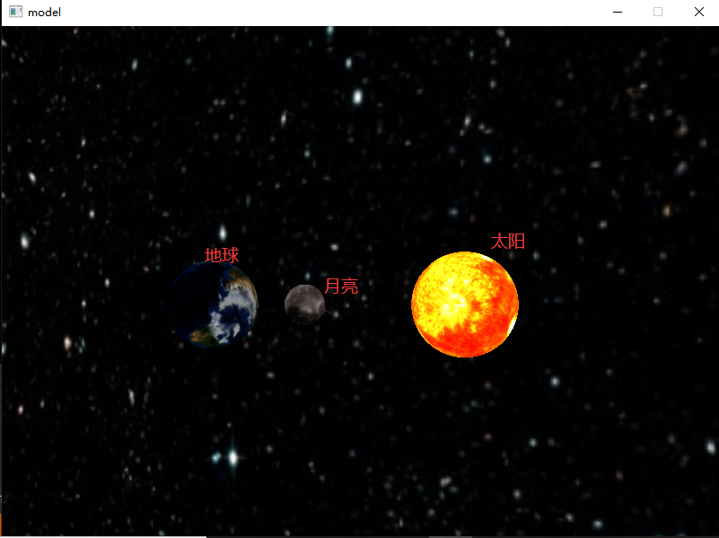
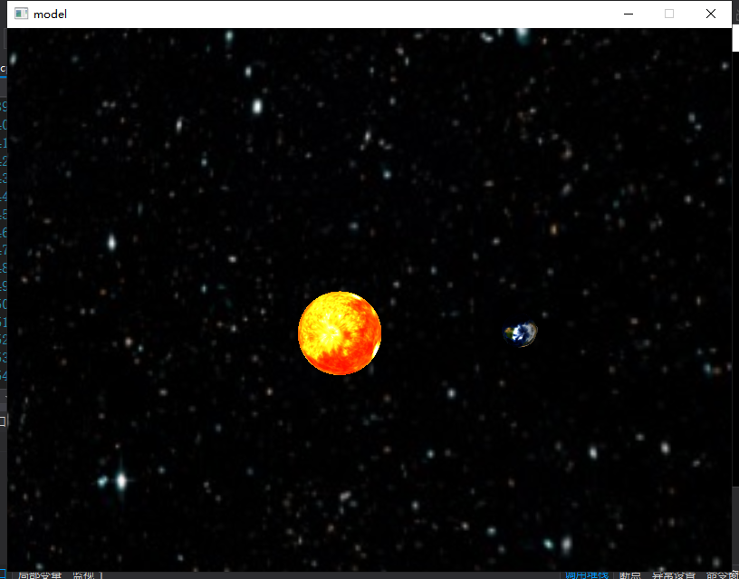

# 微型太阳系 v1.0

- 包含：太阳、月亮、地球

- 地球绕着太阳转、月亮绕着地球转

- 地球表面光照随自转公转变化

- `img/`运行结果图

- `window/`代码文件夹

- `models/`模型文件夹

- 微型太阳系版本将持续更新

## 开发环境

- `C++` 和 `VS2017`

- `GLFW/GLAD`

- 模型加载`Assimp`

- 纹理使用`stb_image.h`库

## 学习链接

- [LearnOpenGL教程](https://learnopengl-cn.github.io/)

- [中国大学Mooc视频课程--计算机图形学(万琳)](https://www.icourse163.org/course/0809HUST055-1003636001?utm_campaign=share&utm_medium=androidShare&utm_source=#/info)

- [万琳老师课程资料的github副本地址](https://gitee.com/findagirl/Computer_Graphics)

- [计算机图形学OPENGL--阿西拜](https://www.bilibili.com/video/av57654623)

